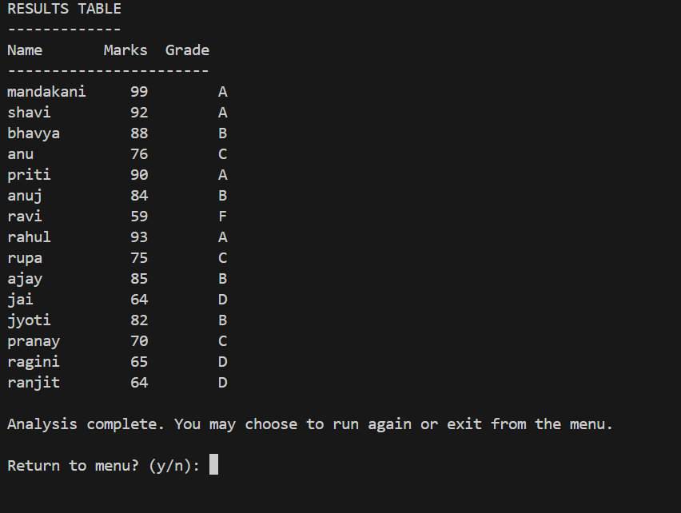

# GradeBook Analyzer

A simple Python program that collects student names and marks, calculates statistics such as average, median, highest, and lowest marks, assigns letter grades, and displays a well-formatted results table.  
It also provides a pass/fail summary and allows multiple analyses using a menu-driven interface.

---

## 📘 Project Information
- **Course:** B.Tech CSE (Data Science)
- **College:** K.R. Mangalam University (KRMU)
- **Submitted by:** Mandakani
- **Submission Date:** 5-11-2025

---

## 🧠 Features
- Accepts names and marks of at least 5 students  
- Calculates **average, median, highest, and lowest** marks  
- Assigns **letter grades (A–F)** based on performance  
- Shows **pass/fail** lists using list comprehension  
- Displays a **neatly formatted results table**  
- Offers a **menu** to re-run analysis or exit  
- Includes **error handling** for invalid inputs

---

## 🖥️ How to Run
1. Make sure Python 3 is installed on your system.  
2. Save the file as `gradebook.py` inside a folder named `gradebook_analyzer`.  
3. Open a terminal or command prompt in that folder.  
4. Run the program with:
   ```bash
   python gradebook.py

---
## 🖼️ Sample Output Screenshot

Below is a sample output of the GradeBook Analyzer program:


